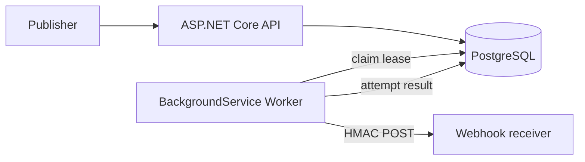

# Reliable Webhook Platform

A production-oriented .NET 10 reference service that registers webhook destinations, accepts JSON events, and delivers them reliably with durable retries. It fits SaaS integrations, internal event fan-out, and systems that need auditable outbound notifications without operating a message broker.

## Architecture

The modular monolith has strict dependency direction: Domain has data/state concepts; Application owns validation, signing, policies, and ports; Infrastructure implements PostgreSQL/Dapper; API and Worker are independent composition roots.



A publish request is validated, then event, one delivery per enabled endpoint, and outbox rows are committed in a single transaction. The worker atomically leases available rows using `FOR UPDATE SKIP LOCKED`, commits, performs HTTP outside the transaction, then records its result. Expired leases make restart recovery safe.

Delivery lifecycle: `Pending → Processing → Succeeded`; failures return to `Pending` with exponential backoff until `FailedTerminal`. Delivery is **at least once**: a crash after the receiver accepts but before result persistence can cause a duplicate. Receivers should deduplicate `X-Webhook-Delivery`.

## Technology and layout

.NET 10, ASP.NET Core Minimal APIs/BackgroundService, PostgreSQL 17, Dapper, Npgsql, xUnit v3, Testcontainers, Docker Compose, and GitHub Actions. Projects live under `src/` (Domain, Application, Infrastructure, Api, Worker), tests under `tests/`, migrations in `src/ReliableWebhook.Infrastructure/Migrations`, and decisions under `docs/decisions`.

## Local setup

Requires .NET 10 and PostgreSQL, or Docker Compose. Configuration uses standard environment mapping such as `Database__ConnectionString` and `Delivery__MaxAttempts`.

```bash
cp .env.example .env
docker compose up --build -d
docker compose ps
curl http://localhost:8080/health/ready
docker compose down
```

For host execution, start PostgreSQL, adjust the connection string, then run `dotnet run --project src/ReliableWebhook.Api` and `dotnet run --project src/ReliableWebhook.Worker`.

## API examples

```bash
curl -X POST localhost:8080/api/webhook-endpoints -H 'Content-Type: application/json' \
  -d '{"destinationUrl":"https://receiver.example/webhooks","secret":"a-random-secret-at-least-16-characters","enabled":true}'

curl -X POST localhost:8080/api/events -H 'Content-Type: application/json' \
  -d '{"eventType":"invoice.paid","payload":{"invoiceId":"inv_123"},"idempotencyKey":"payment-123"}'

curl localhost:8080/api/webhook-endpoints
curl localhost:8080/api/events/00000000-0000-0000-0000-000000000000/deliveries
curl localhost:8080/api/deliveries/00000000-0000-0000-0000-000000000000
```

Creation returns the secret once; subsequent reads never return it. Delete disables an endpoint so historical deliveries remain auditable. Delivery POSTs carry `X-Webhook-Event`, `X-Webhook-Delivery`, and `X-Webhook-Signature: sha256=<lowercase hex>`.

### HMAC verification (C#)

```csharp
var expected = HMACSHA256.HashData(Encoding.UTF8.GetBytes(secret), bodyBytes);
var supplied = Convert.FromHexString(signature["sha256=".Length..]);
var valid = CryptographicOperations.FixedTimeEquals(expected, supplied);
```

Verify against the exact raw request body and reject stale/replayed delivery identifiers according to consumer policy.

## Testing

```bash
dotnet restore
dotnet build --configuration Release
dotnet test --configuration Release
dotnet format --verify-no-changes
docker compose config
```

Integration tests start real ephemeral PostgreSQL containers and therefore require Docker.

## Guarantees, trade-offs, and failure modes

- Transactions prevent events without matching delivery/outbox work; unique idempotency keys prevent duplicate events and reject changed reuse.
- Claims exclude concurrent workers and leases recover abandoned work. Backoff is capped; status and safe, truncated errors remain inspectable.
- PostgreSQL avoids broker operations and makes state observable, trading away broker-scale throughput. Endpoint membership is captured at publish time.
- Network timeout, non-2xx response, DNS/connectivity failure, and expired lease are retried. Exhausted work becomes terminal. Database unavailability makes readiness fail and pauses processing.
- The MVP has no authentication, tenant isolation, endpoint update/re-enable API, manual replay, retention/partitioning, or per-endpoint retry policy.

## Security

Requests are size-limited to 1 MiB, input lengths and URLs are validated, outbound requests time out, secrets never appear in read/inspection models or logs, and signature verification uses constant-time comparison. Secrets are currently stored in PostgreSQL plaintext: production should envelope-encrypt with KMS and rotate keys.

**SSRF:** destination URLs are user-controlled. This MVP restricts schemes but does not resolve/block private, loopback, link-local, or metadata addresses. A production deployment must authenticate registration, apply an allowlist or egress proxy, validate every DNS resolution/redirect target, disable redirects, block reserved address ranges at the network layer, and defend DNS rebinding. Run the worker in a restricted egress network. Never place production credentials in files; inject them through a secret manager.

## Roadmap

Next: authentication and tenancy, encrypted/rotatable secrets, SSRF-safe egress, manual replay and dead-letter tooling, metrics/tracing, rate limiting, retention/partitioning, endpoint update workflows, timestamped signatures, and load/chaos tests.
